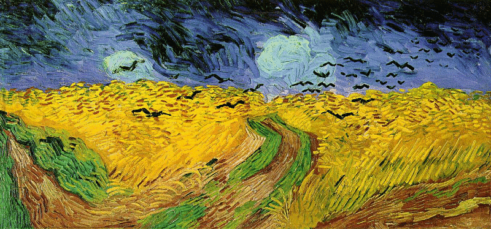
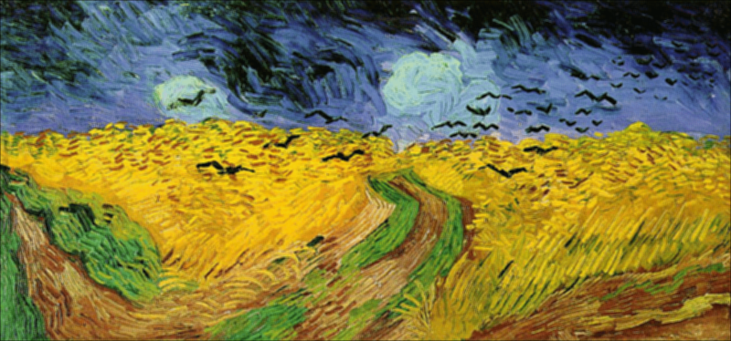
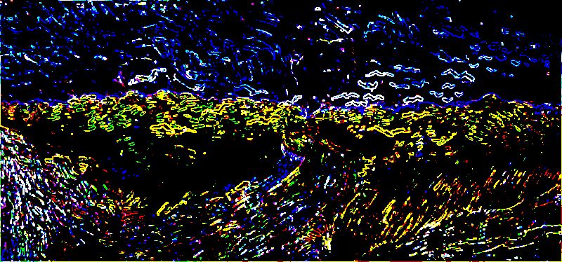
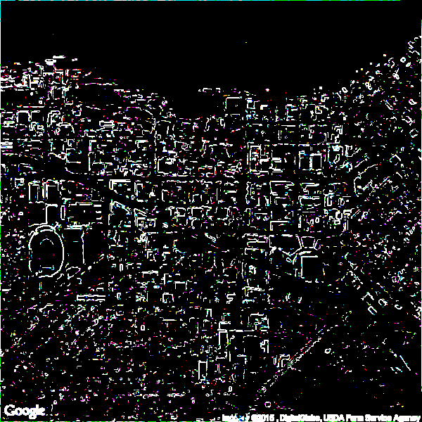

Image smoothing and Edge Detection in R
================
S. Sudhir
2023-04-28

# Implement a parallel mean filter for image smoothing

## Function to implement parallel mean filter

``` r
mean_filter = function(X, k)
{

  ## 'pads' zeroes to n-by-dim(pad.X)[2] matrix
  pad.X = matrix(0, dim(X)[1]+2*k, dim(X)[2]+2*k)
  pad.X[(k+1):(dim(X)[1]+k), (k+1):(dim(X)[2]+k)] = X

  ## assign a temporary pad.X matrix
  temp_pad = pad.X

  ## for-loop to conduct mean_filter
  # loops through rows starting k+1 and ending dim(pad.X)[1]-k
  for (i in (k+1):(dim(pad.X)[1] - k)) 
  {
    # loops through columns starting k+1 and ending dim(pad.X)[1]-k
    for (j in (k+1):(dim(pad.X)[2] - k)) 
    {
      # initializing sum
      sum = 0
      # loops through values -k, ..., 0, ..., k
      for (x in -k:k) 
      {
        # loops through values -k, ..., 0, ..., k
        for (y in -k:k) 
        {
          # sums all adjacent values from pivot [i,j]
          sum = sum + temp_pad[i+x, j+y] 
        }
      }
      # averages all values from sum [much faster than mean()]
      pad.X[i,j] = sum/((2*k + 1)*(2*k + 1)) 
    }
  }

  ## removes 'pad' from dim(pad.X)[1]-by-dim(pad.X)[2] matrix
  mean.X = pad.X[-c(1:k, dim(pad.X)[1]:(dim(pad.X)[1]-k+1)), ][, -c(1:k, dim(pad.X)[2]:(dim(pad.X)[2]-k+1))]

  return(mean.X)
}
```

## Testing function for matrix provided in example

``` r
## Example matrix from https://pages.stat.wisc.edu/~jgillett/305/3/hw3.html 
X = matrix(c(.5,.5,.4,.4,.3,.5,.5,.4,.3,.3,.4,.4,.3,.2,.2,.4,.4,.3,.2,.1,.3,.3,.2,.2,.1), ncol=5)

## image() for original matrix X
image(t(X[nrow(X):1,]), 
      main = "Raw Image")
```

<!-- -->

``` r
## Applying parallel mean filter
mean.X = mean_filter(X = X, k = 1)
mean.X
```

    ##           [,1]      [,2]      [,3]      [,4]       [,5]
    ## [1,] 0.2222222 0.3111111 0.2888889 0.2444444 0.15555556
    ## [2,] 0.3111111 0.4333333 0.4000000 0.3333333 0.21111111
    ## [3,] 0.2777778 0.3777778 0.3333333 0.2777778 0.17777778
    ## [4,] 0.2333333 0.3111111 0.2555556 0.2000000 0.12222222
    ## [5,] 0.1444444 0.1888889 0.1444444 0.1111111 0.06666667

``` r
## image() for mean filtered matrix X
image(t(mean.X[nrow(mean.X):1,]), 
      main = "Mean Filtered Image (k = 1)")
```

<!-- -->

## Loading and running RGB values of Van Gogh image

``` r
## Loading Van_Gogh.png
require(png)
str(vg <- readPNG("Van_Gogh.png"))
```

    ##  num [1:374, 1:800, 1:3] 0.1255 0.3647 0.3059 0.1098 0.0235 ...

<figure>

<figcaption aria-hidden="true">Original Van Gogh Image</figcaption>
</figure>

``` r
## Seperating RGB values
red.vg <- vg[,,1] # R values
green.vg <- vg[,,2] # G values
blue.vg <- vg[,,3] # B values
```

``` r
layout(matrix(1:3, ncol=3))

image(t(red.vg[nrow(red.vg):1,]), 
      col = gray((1:12)/13), 
      main="Red channel")

image(t(green.vg[nrow(green.vg):1,]), 
      col = gray((1:12)/13), 
      main="Green channel")

image(t(blue.vg[nrow(blue.vg):1,]), 
      col = gray((1:12)/13), 
      main="Blue channel")
```

<!-- -->

## Implementing Parallel Mean Filter For Van Gogh Image

### For k = 1

``` r
red_1 = mean_filter(red.vg, k = 1)
green_1 = mean_filter(green.vg, k = 1) 
blue_1 = mean_filter(blue.vg, k = 1)

png_1 = array(data = c(red_1, green_1, blue_1), 
              dim = c(dim(vg)[1], dim(vg)[2], 3))

writePNG(image = png_1,
         target = 'ssudhir_1.png')
```

<figure>

<figcaption aria-hidden="true">k = 1 parallel mean filter Van Gogh
Image</figcaption>
</figure>

### For k = 3

``` r
red_3 = mean_filter(red.vg, k = 3)
green_3 = mean_filter(green.vg, k = 3) 
blue_3 = mean_filter(blue.vg, k = 3)

png_3 = array(data = c(red_3, green_3, blue_3), 
              dim = c(dim(vg)[1], dim(vg)[2], 3))

writePNG(image = png_3,
         target = 'ssudhir_3.png')
```

<figure>

<figcaption aria-hidden="true">k = 3 parallel mean filter Van Gogh
Image</figcaption>
</figure>

### For k = 5

``` r
red_5 = mean_filter(red.vg, k = 5)
green_5 = mean_filter(green.vg, k = 5) 
blue_5 = mean_filter(blue.vg, k = 5)

png_5 = array(data = c(red_5, green_5, blue_5), 
              dim = c(dim(vg)[1], dim(vg)[2], 3))

writePNG(image = png_5,
         target = 'ssudhir_5.png')
```

<figure>

<figcaption aria-hidden="true">k = 5 parallel mean filter Van Gogh
Image</figcaption>
</figure>

## Explanation

For each subsequent k, we can see that the image gets more blurred. The
reason for this is that, for every integer k \> 0, we add a layer of
“padding” of 0’s to our matrix of RGB values and take the mean of
sub-matrices at each non-padded value at the center. The higher our
integer k, the more layer of 0 padding we have for our matrices. Due to
this, when we take the means of the sub-matrices, it tends to gets
smaller and smaller. This results in the RGB values (pixels) getting
diffused and merging into each other, which causes our image to get more
blurry with each subsequent k.

**Note:** for an arbitrary integer k, our window is -k, -k+1, …, 0, …,
k-1, k with 0 at our non-padded value in each direction, i.e.,
(2k+1)-by-(2k+1) matrix. Therefore, for k = 1, our window is a 3-by-3
matrix (-1,0,1). For k = 3, our window is a 7-by-7 matrix
(-3,-2,-1,0,1,2,3). Finally, for k = 5, our window is a 11-by-11 matrix
(-5,-4,-3,-2,-1,0,1,2,3,4,5).

# Implementing Edge Detection

## Function to implement edge detection

``` r
edge_detection = function(X, k)
{

  ## 'pads' zeroes to n-by-dim(pad.X)[2] matrix
  pad.X = matrix(0, dim(X)[1]+2*k, dim(X)[2]+2*k)
  pad.X[(k+1):(dim(X)[1]+k), (k+1):(dim(X)[2]+k)] = X

  ## assign a temporary pad.X matrix
  temp_pad = pad.X

  ## for-loop to conduct mean_filter
  # loops through rows starting k+1 and ending dim(pad.X)[1]-k
  for (i in (k+1):(dim(pad.X)[1] - k))
  {
    # loops through columns starting k+1 and ending dim(pad.X)[1]-k
    for (j in (k+1):(dim(pad.X)[2] - k))
    {
      # initializing empty vector val
      val = c()
      # loops through values -k, ..., 0, ..., k
      for (x in -k:k)
      {
        # loops through values -k, ..., 0, ..., k
        for (y in -k:k)
        {
          # appends all adjacent values from pivot [i,j] into val
          val = append(val, temp_pad[i+x, j+y])
        }
      }
      # finds sd for all values in val
      pad.X[i,j] = sd(val)
    }
  }

  ## removes 'pad' from dim(pad.X)[1]-by-dim(pad.X)[2] matrix
  sd.X = pad.X[-c(1:k, dim(pad.X)[1]:(dim(pad.X)[1]-k+1)), ][, -c(1:k, dim(pad.X)[2]:(dim(pad.X)[2]-k+1))]

  ## Set a threshold for edge detection based on the top 10% of standard deviation values
  threshold <- quantile(sd.X, 0.9)

  ## Set index with sd > threshold = 1, and rest = 0
  for (i in 1:nrow(sd.X)) # cycles through rows
  {
    for (j in 1:ncol(sd.X)) # cycles through columns
    {
      if (sd.X[i,j] >= threshold) # finds indices where sd >= threshold
      {
        sd.X[i,j] = 1 # convert value at index to 1
      }
      else # finds indices where sd < threshold
      {
          sd.X[i,j] = 0 # convert value at index to 0
        }
    }
  }

  return(sd.X)
}
```

## Testing function for matrix provided in example

``` r
## Example matrix from https://pages.stat.wisc.edu/~jgillett/305/3/hw3.html 
X = matrix(c(.5,.5,.4,.4,.3,.5,.5,.4,.3,.3,.4,.4,.3,.2,.2,.4,.4,.3,.2,.1,.3,.3,.2,.2,.1), ncol=5)

## image() for original matrix X
image(t(X[nrow(X):1,]), 
      main = "Raw Image")
```

<!-- -->

``` r
## Applying parallel mean filter
sd.X = edge_detection(X = X, k = 1)
sd.X
```

    ##      [,1] [,2] [,3] [,4] [,5]
    ## [1,]    1    1    0    0    0
    ## [2,]    1    0    0    0    0
    ## [3,]    0    0    0    0    0
    ## [4,]    0    0    0    0    0
    ## [5,]    0    0    0    0    0

``` r
## image() for mean filtered matrix X
image(t(sd.X[nrow(sd.X):1,]), 
      main = "Edge Detection Image (k = 1)")
```

<!-- -->

## Loading and running RGB values of Van Gogh image

``` r
## Loading Van_Gogh.png
require(png)
str(vg <- readPNG("Van_Gogh.png"))
```

    ##  num [1:374, 1:800, 1:3] 0.1255 0.3647 0.3059 0.1098 0.0235 ...

<figure>

<figcaption aria-hidden="true">Original Van Gogh Image</figcaption>
</figure>

``` r
red.vg <- vg[,,1] # R values
green.vg <- vg[,,2] # G values
blue.vg <- vg[,,3] # B values
layout(matrix(1:3, ncol=3))

image(t(red.vg[nrow(red.vg):1, ]), 
      col = gray((1:12)/13), 
      main="Red channel")

image(t(green.vg[nrow(green.vg):1, ]), 
      col = gray((1:12)/13), 
      main="Green channel")

image(t(blue.vg[nrow(blue.vg):1, ]), 
      col = gray((1:12)/13), 
      main="Blue channel")
```

<!-- -->

## Implementing Edge Detection in Van Gogh

``` r
red.van = edge_detection(red.vg, k = 1)
green.van = edge_detection(green.vg, k = 1) 
blue.van = edge_detection(blue.vg, k = 1)

png.van = array(data = c(red.van, green.van, blue.van), 
                dim = c(dim(vg)[1], dim(vg)[2], 3))

writePNG(image = png.van,
         target = 'ssudhir_Van_Gogh.png')
```

<figure>

<figcaption aria-hidden="true">Edge Detection for Van Gogh</figcaption>
</figure>

## Loading and running RGB values of Madison

``` r
## Loading Van_Gogh.png
require(png)
str(vg <- readPNG("Madison.png"))
```

    ##  num [1:600, 1:600, 1:3] 0.235 0.267 0.251 0.267 0.349 ...

<figure>

<figcaption aria-hidden="true">Original Madison Image</figcaption>
</figure>

``` r
## Seperating RGB values
red.vg <- vg[,,1] # R values
green.vg <- vg[,,2] # G values
blue.vg <- vg[,,3] # B values
```

``` r
layout(matrix(1:3, ncol=3))

image(t(red.vg[nrow(red.vg):1, ]), 
      col = gray((1:12)/13), 
      main="Red channel")

image(t(green.vg[nrow(green.vg):1, ]), 
      col = gray((1:12)/13), 
      main="Green channel")

image(t(blue.vg[nrow(blue.vg):1, ]), 
      col = gray((1:12)/13), 
      main="Blue channel")
```

<!-- -->

## Implementing Edge Detection for Madison

``` r
red.mad = edge_detection(red.vg, k = 1)
green.mad = edge_detection(green.vg, k = 1) 
blue.mad = edge_detection(blue.vg, k = 1)

png.mad = array(data = c(red.mad, green.mad, blue.mad), 
                dim = c(dim(vg)[1], dim(vg)[2], 3))

writePNG(image = png.mad,
         target = 'ssudhir_madison.png')
```

<figure>

<figcaption aria-hidden="true">Edge Detection for Madison</figcaption>
</figure>

## Explanation

For the Van Gogh image, the edge detection threshold of 90% highlights
the birds, the blue sky (with stripes of black in them), the grass,
fields, and brown road are the edges. That said, it is important to note
that even in areas where the color is relatively the same (the yellow
fields for instance), there are many countless small strokes that fill
the area up. Due to this, the edge detector occasionally leaks, and
detects edges that are not necessarily there.

For the Madison image, the edge detection threshold of 90% mostly
highlights the buildings, the border of the lake, and some of the trees.
Like the Van Gogh image, the Madison image comprises of many small
buildings that are closely packed to each other, due to which the edge
detector occasionally leaks and detects edges that are not necessarily
there.

**Note:** for an arbitrary integer k, our window is -k, -k+1, …, 0, …,
k-1, k with 0 at our non-padded value in each direction, i.e.,
(2k+1)-by-(2k+1) matrix. As we only consider k = 1, our window is a
3-by-3 matrix (-1,0,1).
